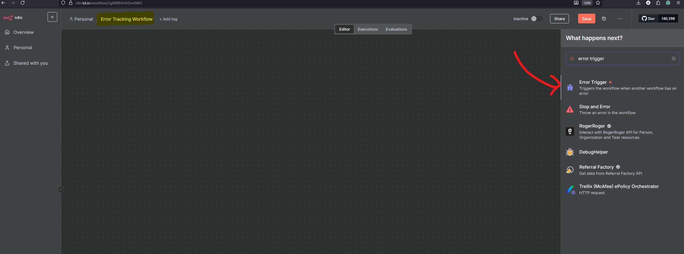

# n8n Workflow Monitoring Implementation Guide (DevOps Workflow)

> Complete setup guide for Error Tracking and Performance Monitoring workflows

---

## Table of Contents

1. [Overview](#overview)
2. [Error Tracking Workflow](#error-tracking-workflow)
3. [Performance Monitoring Workflow](#performance-monitoring-workflow)
4. [Integration Steps](#integration-steps)
5. [Environment Variables](#environment-variables)
6. [Troubleshooting](#troubleshooting)

---

## Overview

This guide covers implementing two monitoring workflows in n8n:

- **Error Tracking**: Automatically captures and reports workflow failures
- **Performance Monitoring**: Analyzes execution times and alerts on performance degradation

Both workflows use Slack for alerting and can be applied to any existing n8n workflow.

---

## Error Tracking Workflow

### Purpose

Automatically detect and report workflow failures across your n8n instance.

### Architecture

```
Error Trigger → Alert (E.g. Slack Message)
```

### Implementation Steps

#### Step 1: Create Error Tracking Workflow

1. Create a new workflow named `Error_Tracking_Monitor`
2. Add an **Error Trigger** node



3. Add a **Slack** node for notifications


#### Step 2: Enable Error Reporting in Target Workflows

1. Open the workflow you want to monitor
2. Go to **Workflow Settings**
   
3. Navigate to **Error Workflow** section and select `Error_Tracking_Workflow`
   
4. Save those settings

After following these steps we have enabled the error tracking feature for our workflow.

#### Error Message Format Example

```
[
  {
    "execution": {
      "id": "13853",
      "url": "https://n8n.tsl.io/workflow/RPZ73q9NNp5raKiL/executions/13853",
      "error": {
        "level": "warning",
        "tags": {},
        "description": "You have exceeded the MONTHLY quota for Requests on your current plan, BASIC. Upgrade your plan at https://rapidapi.com/letscrape-6bRBa3QguO5/api/company-data12",
        "timestamp": 1758476386005,
        "context": {
          "itemIndex": 0,
          "request": {
            "headers": {
              "x-rapidapi-host": "company-data12.p.rapidapi.com",
              "x-rapidapi-key": "617cab6a0emshf5244ed29928f8ep1a2622jsndcf793902fe0",
              "accept": "application/json,text/html,application/xhtml+xml,application/xml,text/*;q=0.9, image/*;q=0.8, */*;q=0.7"
            },
            "method": "GET",
            "uri": "https://company-data12.p.rapidapi.com/company-search",
            "gzip": true,
            "rejectUnauthorized": true,
            "followRedirect": true,
            "resolveWithFullResponse": true,
            "followAllRedirects": true,
            "timeout": 300000,
            "qs": {
              "query": "The SilverLogic",
              "limit": "10",
              "min_rating": "any",
              "min_review_count": "any",
              "locale": "en-US"
            },
            "encoding": null,
            "json": false,
            "useStream": true
          }
        },
        "functionality": "regular",
        "name": "NodeApiError",
        "node": {
          "parameters": {
            "preBuiltAgentsCalloutHttpRequest": "",
            "curlImport": "",
            "method": "GET",
            "url": "https://company-data12.p.rapidapi.com/company-search",
            "authentication": "none",
            "provideSslCertificates": false,
            "sendQuery": true,
            "specifyQuery": "keypair",
            "queryParameters": {
              "parameters": [
                {
                  "name": "query",
                  "value": "={{ $json.apiQuery }}"
                },
                {
                  "name": "limit",
                  "value": "10"
                },
                {
                  "name": "min_rating",
                  "value": "any"
                },
                {
                  "name": "min_review_count",
                  "value": "any"
                },
                {
                  "name": "locale",
                  "value": "en-US"
                }
              ]
            },
            "sendHeaders": true,
            "specifyHeaders": "keypair",
            "headerParameters": {
              "parameters": [
                {
                  "name": "x-rapidapi-host",
                  "value": "company-data12.p.rapidapi.com"
                },
                {
                  "name": "x-rapidapi-key",
                  "value": "617cab6a0emshf5244ed29928f8ep1a2622jsndcf793902fe0"
                }
              ]
            },
            "sendBody": false,
            "options": {},
            "infoMessage": ""
          },
          "type": "n8n-nodes-base.httpRequest",
          "typeVersion": 4.2,
          "position": [
            752,
            -80
          ],
          "id": "91e4817a-7663-4691-98dc-23b07d54a914",
          "name": "Company Search"
        },
        "messages": [
          "Try spacing your requests out using the batching settings under 'Options'"
        ],
        "httpCode": "429",
        "message": "The service is receiving too many requests from you",
        "stack": "NodeApiError: The service is receiving too many requests from you\n    at ExecuteContext.execute (/usr/local/lib/node_modules/n8n/node_modules/.pnpm/n8n-nodes-base@file+packages+nodes-base_@aws-sdk+credential-providers@3.808.0_asn1.js@5_1af219c3f47f2a1223ec4ccec249a974/node_modules/n8n-nodes-base/nodes/HttpRequest/V3/HttpRequestV3.node.ts:783:16)\n    at processTicksAndRejections (node:internal/process/task_queues:105:5)\n    at WorkflowExecute.executeNode (/usr/local/lib/node_modules/n8n/node_modules/.pnpm/n8n-core@file+packages+core_@opentelemetry+api@1.9.0_@opentelemetry+sdk-trace-base@1.30_5aee33ef851c7de341eb325c6a25e0ff/node_modules/n8n-core/src/execution-engine/workflow-execute.ts:1253:8)\n    at WorkflowExecute.runNode (/usr/local/lib/node_modules/n8n/node_modules/.pnpm/n8n-core@file+packages+core_@opentelemetry+api@1.9.0_@opentelemetry+sdk-trace-base@1.30_5aee33ef851c7de341eb325c6a25e0ff/node_modules/n8n-core/src/execution-engine/workflow-execute.ts:1427:11)\n    at /usr/local/lib/node_modules/n8n/node_modules/.pnpm/n8n-core@file+packages+core_@opentelemetry+api@1.9.0_@opentelemetry+sdk-trace-base@1.30_5aee33ef851c7de341eb325c6a25e0ff/node_modules/n8n-core/src/execution-engine/workflow-execute.ts:1727:27\n    at /usr/local/lib/node_modules/n8n/node_modules/.pnpm/n8n-core@file+packages+core_@opentelemetry+api@1.9.0_@opentelemetry+sdk-trace-base@1.30_5aee33ef851c7de341eb325c6a25e0ff/node_modules/n8n-core/src/execution-engine/workflow-execute.ts:2303:11"
      },
      "lastNodeExecuted": "Company Search",
      "mode": "webhook"
    },
    "workflow": {
      "id": "RPZ73q9NNp5raKiL",
      "name": "BRDGIT ROI ASSESSMENT ASSISTANT"
    }
  }
]
```

---

## Performance Monitoring Workflow

### Purpose

Monitor workflow execution times and alert when performance degrades significantly compared to historical averages.

### Architecture

```
Webhook Trigger → Get Current Execution → Get Historical Executions → Performance Analysis → Slack Alert
```

### Implementation Steps

#### Step 1: Create Performance Monitoring Workflow

Create a new workflow named `Performance_Monitor`, this workflow will have four nodes:


#### Step 2: Configure 1st Node - Webhook Trigger

**Node Configuration:**

- **Node Type:** Webhook
- **HTTP Method:** POST
- **Path:** leave as default value
- **Response Mode:** Immediately


#### Step 3: Set HTTP Post Request to trigger the Performance Monitor Workflow

Add an HTTP Request Node inside of the workflow we want to monitor, this will be a POST request:


~ Fill the URL field with the Production URL from the Performance Monitor Workflow's first node and replicate the settings shown in the image above.

~ For the body of this HTTP Post request use the following JSON:

```
{
    "workflow_name": "{{$workflow.name}}",
    "workflow_id": "{{$workflow.id}}",
    "execution_id": "{{$execution.id}}"
  }
```

#### Step 4: n8n Endpoint and API Key

In order to access the execution logs of any workflow, n8n provides the following endpoint:

**API Endpoint:**

`https://n8n.tsl.io/api/v1/executions/`

To be able to use it in our Performance Monitor workflow, we need to configure an API Key.

1. Access account settings on n8n:
   

2. Click on n8n API and create a new API Key:
   
   

3. Once created, copy the API Key, as we'll need it for the following steps:
   

#### Step 5: Configure Current Execution HTTP Request

Back to the Performance Monitor Workflow, add an HTTP Request node (GET), you can name it Get_Current_Execution:


We are going to use the endpoint shared in the prior step and add the `execution_id` as a parameter (this comes from the HTTP Post Request we added to the workflow we are monitoring).

Set the URL type to 'Expression' and use the following URL:


```
https://n8n.tsl.io/api/v1/executions/{{$json.body.execution_id}}
```

Finally, we need to add as a header parameter the n8n API key we created on Step 4, use as Name `X-N8N-API-KEY` and paste in the Value field the API Key.

#### Step 6: Configure Historical Executions HTTP Request

Create a second HTTP GET request, similar to Step 5, and replicate the settings bellow (you can name it Get_All_Executions):


**Node Configuration:**

```json

{{
    workflowId: {{ $('Webhook').item.json.body.workflow_id }},
    limit: 50,
    status: success,
    includeData: false,

}}

```

_Note: Make sure to change the value type of the workflowId parameter to `Expression`_

Feel free to play around with the `limit` value (this represents how many execution logs to fetch), the good practice is to include as much executions as possible given the execution history of the workflow we want to monitor. If the workflow has changed a lot in its production history, we may need to lower the limit value to represent the most recent execution timing pattern for fair comparisons.

#### Step 5: Configure Performance Analysis Code Node

The last step is to incorporate the performance analysis logic, we need to create a Code Node and use the following code:

**Node Configuration:**

- **Node Type:** Code
- **Language:** JavaScript

**Code Block:**

```javascript
// === DevOps Performance Analysis  ===

// Get webhook data
const webhookData = items[0].json;

// Get data from other nodes using node references
let currentExecution, historicalResponse;

try {
  // Try to get data from the HTTP Request nodes by name
  currentExecution = $("Get_Current_Execution").first().json;
  historicalResponse = $("Get_All_Executions").first().json;

  console.log("Current execution:", currentExecution);
  console.log("Historical response:", historicalResponse);
} catch (error) {
  console.log("Error accessing node data:", error.message);

  // Fallback: if we can't access by name, return error
  return [
    {
      json: {
        alert_needed: false,
        error: "Could not access execution data from HTTP Request nodes",
        execution_id: webhookData.execution_id,
        workflow_name: webhookData.workflow_name,
        debug: {
          available_items: items.length,
          webhook_data: webhookData,
        },
      },
    },
  ];
}

// Validate API responses
if (!currentExecution || currentExecution.error) {
  return [
    {
      json: {
        alert_needed: false,
        error: "Failed to fetch current execution data",
        execution_id: webhookData.execution_id,
        workflow_name: webhookData.workflow_name,
        debug: { current_execution: currentExecution },
      },
    },
  ];
}

if (!historicalResponse || historicalResponse.error) {
  return [
    {
      json: {
        alert_needed: false,
        error: "Failed to fetch historical execution data",
        execution_id: webhookData.execution_id,
        workflow_name: webhookData.workflow_name,
        debug: { historical_response: historicalResponse },
      },
    },
  ];
}

const historicalExecutions =
  historicalResponse.data || historicalResponse || [];

// Check if current execution completed
if (!currentExecution.stoppedAt) {
  // Note: API doesn't return status field, check if it failed by other means
  if (currentExecution.finished === false) {
    return [
      {
        json: {
          alert_needed: true,
          severity: "critical",
          alert_type: "execution_error",
          workflow_name: webhookData.workflow_name,
          execution_id: webhookData.execution_id,
          message: `Workflow execution failed or still running`,
          slack_message: {
            channel: "#alerts",
            text: `🚨 *Workflow Execution Issue: ${webhookData.workflow_name}*`,
            attachments: [
              {
                color: "danger",
                fields: [
                  {
                    title: "Execution ID",
                    value: `\`${webhookData.execution_id}\``,
                    short: true,
                  },
                  {
                    title: "Finished",
                    value: currentExecution.finished ? "Yes" : "No",
                    short: true,
                  },
                ],
              },
            ],
          },
        },
      },
    ];
  }

  return [
    {
      json: {
        alert_needed: false,
        message: `Execution ${webhookData.execution_id} still running (finished: ${currentExecution.finished})`,
        execution_id: webhookData.execution_id,
        workflow_name: webhookData.workflow_name,
      },
    },
  ];
}

// Calculate current execution duration
const currentStartTime = new Date(currentExecution.startedAt);
const currentEndTime = new Date(currentExecution.stoppedAt);
const currentDuration = (currentEndTime - currentStartTime) / 1000; // seconds

// Filter and calculate historical durations
const historicalDurations = historicalExecutions
  .filter((exec) => {
    // Exclude current execution and incomplete executions
    return (
      exec.id !== webhookData.execution_id &&
      exec.stoppedAt &&
      exec.finished === true
    );
  })
  .map((exec) => {
    const start = new Date(exec.startedAt);
    const end = new Date(exec.stoppedAt);
    const duration = (end - start) / 1000;
    return duration;
  })
  .filter((duration) => {
    // Filter out unreasonable durations (0-1 hour range)
    return duration > 0 && duration < 3600;
  });

// Check if we have enough historical data
if (historicalDurations.length < 3) {
  return [
    {
      json: {
        alert_needed: false,
        message: `Insufficient historical data for ${webhookData.workflow_name} (${historicalDurations.length} successful executions)`,
        current_duration: Math.round(currentDuration),
        execution_id: webhookData.execution_id,
        workflow_name: webhookData.workflow_name,
        historical_count: historicalDurations.length,
      },
    },
  ];
}

// Calculate performance statistics
const avgDuration =
  historicalDurations.reduce((sum, d) => sum + d, 0) /
  historicalDurations.length;
const slownessFactor = currentDuration / avgDuration;
const slownessPercentage = (slownessFactor - 1) * 100;

// Fixed thresholds
const thresholds = {
  notice: 1.3, // 30% slower
  warning: 1.5, // 50% slower
  critical: 2.0, // 100% slower
};

// Determine if alert is needed
const isSignificantlySlow = slownessFactor > thresholds.notice;

// Generate result
const result = {
  alert_needed: isSignificantlySlow,
  workflow_name: $("Webhook").first().json.body.workflow_name,
  workflow_id: $("Webhook").first().json.body.workflow_id,
  execution_id: $("Webhook").first().json.body.execution_id,
  current_duration: Math.round(currentDuration),
  average_duration: Math.round(avgDuration),
  slowness_percentage: Math.round(slownessPercentage),
  slowness_factor: Math.round(slownessFactor * 100) / 100,
  historical_count: historicalDurations.length,
  timestamp: new Date().toISOString(),
};

// OPTIONAL STEP: Add Slack message if alert needed. ***If you are not sending messages through slack or want to change the format feel free to do so...***

if (isSignificantlySlow) {
  result.slack_message = {
    channel: "#alerts",
    text: `⚠️ *Performance Alert: ${
      $("Webhook").first().json.body.workflow_name
    }*`,
    attachments: [
      {
        color:
          slownessFactor > thresholds.critical
            ? "danger"
            : slownessFactor > thresholds.warning
            ? "warning"
            : "good",
        fields: [
          {
            title: "Current Duration",
            value: `${result.current_duration}s`,
            short: true,
          },
          {
            title: "Average Duration",
            value: `${result.average_duration}s`,
            short: true,
          },
          {
            title: "Performance Impact",
            value: `${result.slowness_percentage}% slower than average`,
            short: true,
          },
          {
            title: "Based on",
            value: `${result.historical_count} recent executions`,
            short: true,
          },
          {
            title: "Execution ID",
            value: `\`${result.execution_id}\``,
            short: false,
          },
        ],
        ts: Math.floor(Date.now() / 1000),
      },
    ],
  };
}

console.log("DevOps Monitor Analysis:", {
  workflow: $("Webhook").first().json.body.workflow_name,
  current_duration: result.current_duration,
  average_duration: result.average_duration,
  slowness_percentage: result.slowness_percentage,
  alert_needed: result.alert_needed,
  historical_count: result.historical_count,
});

return [{ json: result }];
```

In this code there's a Slack formatted message with the result for convenience, feel free to just use `result` if you are not sending messages through Slack and/or change the format accordingly.

Make sure to save this workflow and set it to Active.

#### Optional Step: Configure Slack Alert Node


In this example we are using an If Node with a `true` branch that is triggered if `alert_needed === true`. This value comes from `result.slack_message` in the prior node.

#### Important Integration Notes

- Set **"Never Error"** to `true` in monitoring HTTP requests
- Place monitoring calls at the end of business logic
- Ensure monitoring failures don't break main workflows

---

## Troubleshooting

### Common Issues

#### Error Tracking Not Working

- **Verify error workflow is activated**
- **Check workflow settings have error reporting enabled**
- **Ensure Slack credentials are configured correctly**

#### Performance Monitoring Issues

- **Webhook not receiving data:** Check HTTP request configuration in monitored workflow
- **API authentication failures:** Verify N8N_API_KEY is correct
- **No historical data:** Ensure workflow has been executed multiple times

#### Performance Analysis Failures

- **"Cannot read properties of undefined":** Check node connections and input structure
- **"Insufficient historical data":** Need at least 3 successful executions for comparison

### Support Information

#### API Endpoints Used

- **Current Execution:** `GET /api/v1/executions/{id}`
- **Historical Executions:** `GET /api/v1/executions`

#### Slack Message Format

Both workflows use Slack's attachment format for rich notifications with color coding and structured fields.

#### Performance Thresholds

- **Notice (30% slower):** Yellow alert
- **Warning (50% slower):** Orange alert
- **Critical (100%+ slower):** Red alert

---

## Conclusion

These monitoring workflows provide comprehensive error tracking and performance analysis for n8n workflows. The error tracking requires no code changes to monitored workflows, while performance monitoring requires only a single HTTP request node addition.

Both systems are designed to be non-intrusive and fail-safe, ensuring that monitoring issues don't affect business workflow operations.
